<div align="center">

# Q·Peptide

### Quantum-assisted constrained optimization for antimicrobial peptide design

**Qiskit Fall Fest 2026 submission**

*Which two or three amino-acid substitutions most improve a peptide's predicted
activity-versus-hemolysis trade-off — and can we prove the answer is optimal?*

[](tests/)
[](https://qiskit.org)
[](LICENSE)
[](http://dramp.cpu-bioinfor.org/)

</div>


---

> ### ⚠️ This is a computational tool
> Every activity and hemolysis value it produces is a **model prediction**. Nothing here has
> been synthesised or assayed. No experimental validation is claimed or implied.

---

## Contents

| | |
|---|---|
| [1. Problem statement](#1-problem-statement) | What is being optimized, and why it is a QUBO |
| [2. Architecture](#2-architecture) | System design and data flow |
| [3. The quantum optimization](#3-the-quantum-optimization) | QUBO → Ising → QAOA, in detail |
| [4. Results](#4-results) | Measured outcomes, including the unflattering ones |
| [5. Quickstart](#5-quickstart) | Install and run |
| [6. Connecting IBM Quantum](#6-connecting-ibm-quantum) | Optional real-hardware execution |
| [7. The interface](#7-the-interface) | Screenshots |
| [8. Repository](#8-repository) | Layout and documents |
| [9. Limitations](#9-limitations-and-claims-not-made) | What this does **not** show |

**Companion documents:**
[`notebooks/Q_Peptide_Demo.ipynb`](notebooks/Q_Peptide_Demo.ipynb) (executed, with outputs) ·
[`docs/ARCHITECTURE.md`](docs/ARCHITECTURE.md) (HLD + LLD) ·
[`docs/IMPLEMENTATION_AUDIT.md`](docs/IMPLEMENTATION_AUDIT.md) (built vs. claimed) ·
[`research/scientific_audit.md`](research/scientific_audit.md) (adversarial self-review) ·
[`research/literature_review.md`](research/literature_review.md) ·
[`research/papers.md`](research/papers.md)

---

## 1. Problem statement

Antimicrobial peptides are candidate antibiotics. The property that makes them kill
bacteria — a cationic, amphipathic structure that disrupts membranes — also makes them
liable to lyse human red blood cells. Improving one while worsening the other is easy;
**improving the trade-off is the actual problem.**

A medicinal chemist holding a known peptide asks something concrete: *which two or three
substitutions should I make?* With ~14 candidate substitutions there are thousands of
combinations, the substitutions **interact**, and some are **mutually exclusive** — two
residues cannot occupy the same position.

That is a constrained quadratic binary optimization problem:

$$\max_{x}\;\; \widehat{\Delta S}(x) = \sum_i \Delta_i x_i + \sum_{i<j} \Delta_{ij} x_i x_j
\qquad\text{s.t.}\qquad \sum_i x_i \le K,\quad x_i + x_j \le 1,\quad x_i \in \{0,1\}$$

where $x_k = 1$ means "apply substitution $k$", and

$$\Delta_i = S(P\oplus m_i) - S(P), \qquad
\Delta_{ij} = S(P_{ij}) - S(P_i) - S(P_j) + S(P)$$

$S$ combines predicted activity and predicted hemolysis, with the sign convention fixed in
exactly one place:

$$S(P) = \alpha\,\tilde A(P) - \beta\,\tilde H(P), \qquad \textbf{larger is better}$$

> **The quantum computer is not simulating protein folding.** It solves the
> subset-selection problem above.

### Why this is genuinely a QUBO

Three things must hold. All three were **measured**, not assumed:

| requirement | measured | meaning |
|---|---|---|
| the quadratic term matters | $\mathrm{mean}\lvert\Delta_{ij}\rvert / \mathrm{mean}\lvert\Delta_i\rvert \approx 0.57\text{–}0.62$ | not additive; sorting cannot solve it |
| constraints are combinatorial | budget + pairwise exclusivity | not box constraints |
| coefficients are computable | $1 + N + \binom{N}{2}$ model calls (92–106 at $N{=}14$) | exact, not fitted |

### The methodological contribution

The coefficients are **computed by running the ML models on the actual mutant sequences**,
not fitted to sampled scores the way the closest prior work does. That removes an entire
layer of surrogate error — and makes the error that remains **measurable**, which is what
the rest of this project spends its effort on.

---

## 2. Architecture

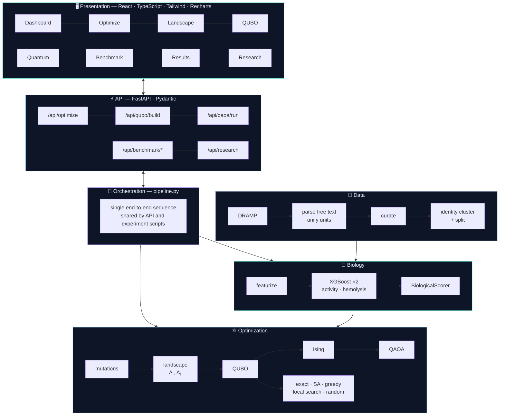

### The pipeline, end to end

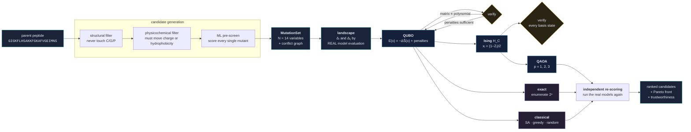

Full HLD and LLD — module map, data structures, complexity, testing strategy — in
[`docs/ARCHITECTURE.md`](docs/ARCHITECTURE.md).

---

## 3. The quantum optimization

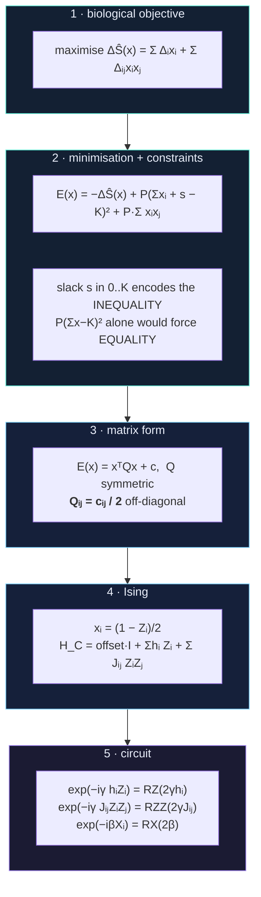

### 3.1 Constraint encoding — two genuinely different constraints

This is where QUBO implementations usually go wrong. $P(\sum x_i - K)^2$ enforces
**equality**, not $\le K$. Using it for an inequality is silently incorrect, so both modes
exist and are never conflated — the UI states which one you are choosing.

| mode | constraint | encoding | extra qubits |
|---|---|---|---|
| `AT_MOST_K` | $\sum x_i \le K$ | slack $s \in [0,K]$; penalise $P(\sum x_i + s - K)^2$ | $\lceil\log_2(K{+}1)\rceil$ |
| `EXACTLY_K` | $\sum x_i = K$ | penalise $P(\sum x_i - K)^2$ | 0 |

Slack weights are $[1, 2, 4, \ldots, K - 2^{m-1} + 1]$ — the top weight is **clamped** so
the representable set is exactly $\{0,\ldots,K\}$ with no over-coverage. Asserted for every
$K$ from 0 to 17.

Same-position exclusivity needs no slack: the constraint is violated only by the single
assignment $x_i = x_j = 1$, so a quadratic penalty suffices. Conflicts reach the builder as
an explicit graph — the optimizer never parses sequence strings.

### 3.2 Penalty magnitude — derived, then verified

A hard-coded $P = 1000$ is rejected. The **exact span** of the unconstrained objective is
computed by enumeration:

$$\mathrm{span} = \max_x \widehat{\Delta S}(x) - \min_x \widehat{\Delta S}(x),
\qquad P = \lambda\,(\mathrm{span} + \epsilon), \quad \lambda = 2$$

Any $P > \mathrm{span}$ is provably sufficient: satisfying the constraints costs at most
$\mathrm{span}$, so a violation can never pay for itself. The looser triangle bound
$B = \sum\lvert\Delta_i\rvert + \sum\lvert\Delta_{ij}\rvert$ is ~2.4× larger.

Then it is **verified by enumeration** — every infeasible assignment must have strictly
higher energy than the best feasible one. Measured margins: **47.68** and **48.54**.
A test asserts that a deliberately tiny penalty *fails* this check; a verifier that always
passes is worthless.

### 3.3 Ising mapping, checked on every basis state

$$\text{offset} = c + \tfrac12\textstyle\sum_i c_i + \tfrac14\sum_{i<j} c_{ij}, \qquad
h_i = -\tfrac12 c_i - \tfrac14\textstyle\sum_{j \ne i} c_{ij}, \qquad
J_{ij} = \tfrac14 c_{ij}$$

The identity offset is **kept**, so $\langle x|H_C|x\rangle = E_{\mathrm{QUBO}}(x)$ exactly.
Because $H_C$ is diagonal this is **exhaustively checkable** — 65,536 states at 16 qubits,
max deviation **9.1e-12**.

### 3.4 Circuit construction

Because $H_C$ is diagonal, $e^{-i\gamma H_C}$ factorises **exactly** into commuting
rotations, so the circuit is built from `RZ`/`RZZ`/`RX` directly rather than through
generic Pauli-evolution synthesis. This is not cosmetic: generic synthesis exponentiates a
sparse matrix on *every objective evaluation*, and replacing it took the variational loop
from minutes to **under two seconds**.

**Mixer:** standard transverse-field X mixer with penalty-based constraints. A
constraint-preserving mixer — which would keep the state in the feasible subspace and
remove the penalties entirely — is the documented alternative and the single most promising
improvement. Recorded as future work, not silently assumed.

**γ reparameterisation:** penalised QUBOs have large coefficients, so $e^{-i\gamma H_C}$
wraps through many full rotations and the landscape becomes violently oscillatory. The
circuit divides cost coefficients by their largest magnitude — a pure change of variables.
Spectrum ordering is untouched; every reported energy uses the **unscaled** diagonal.

### 3.5 Two simulators, one checked against the other

The variational loop uses a specialised NumPy simulator (diagonal phase as one vectorised
multiply, each RX as a reshape). Everything else — sampling, noise, hardware — uses the
real Qiskit circuit. `verify_simulator_agreement` asserts they match to **4.6e-16**, and
that check runs at *every* problem size. The fast path is checked, not trusted.

### 3.6 Measurement honesty

Two traps, both avoided deliberately:

- On an ideal simulator every basis state has nonzero amplitude, so reading "best energy"
  off the statevector's support returns the global optimum **regardless of parameter
  quality**. Best-sampled energy is drawn from a *finite* multinomial sample.
- **Success probability is summed over all degenerate optima**, not the frequency of one
  arbitrary optimal bitstring.
- **Two-qubit gates are counted by gate arity, not by name** — a name-based count returns
  *zero* for Aer-transpiled circuits, which support `rzz` natively. This was a real bug,
  caught by a test.

Absolute energy gap $E_{\mathrm{found}} - E^*$ is the primary metric. The ratio
$E_{\mathrm{found}}/E^*$ is **deliberately never reported** — QUBO energies are
sign-indefinite, so that ratio is meaningless.

---

## 4. Results

All figures come from executed runs in `results/experiments/`. Re-running regenerates them.

### 4.1 The QUBO's validity regime is measured, not assumed

| mutations selected | status | evidence (N=14) |
|---|---|---|
| 0, 1, 2 | **exact** | across all 102 feasible candidates at K=2: MAE **0.0000**, Spearman **1.000** |
| 3 | **mediocre** | exhaustive over all 316 feasible 3-subsets: ρ = 0.516, but the surrogate's own top pick ranks **164th of 316** — the 48th percentile |

The quadratic model reproduces first- and second-order effects exactly. Once three
substitutions combine, omitted third-order interactions carry enough of the signal that the
surrogate's *preference ordering* becomes close to uninformative.

**Consequence, built into the pipeline:** candidates are ranked by **direct ML re-scoring**,
never by QUBO energy.

### 4.2 QAOA concentrates probability; the margin grows with size

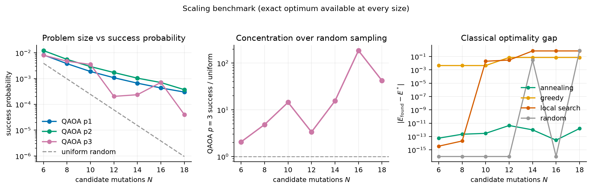

Success probability as a multiple of uniform random sampling — the baseline that matched
QAOA on a comparable peptide problem (Boulebnane et al. 2022):

| N (qubits) | uniform random | p=1 | p=2 | p=3 |
|---|---|---|---|---|
| 6 (8)   | 3.9e-3 | 2.1×   | 3.1×   | 2.1×   |
| 10 (12) | 2.4e-4 | 7.7×   | 11.9×  | 14.5×  |
| 14 (16) | 1.5e-5 | 43.5×  | 68.0×  | 15.5×  |
| 16 (18) | 3.8e-6 | 113.8× | 184.5× | **185.8×** |
| 18 (20) | 9.5e-7 | 315.1× | **390.0×** | 42.4× |

**Two caveats that matter more than the headline:**

- **Depth does not reliably help.** p=3 is *worse* than p=2 at N=12, 14 and 18. In one run
  p=3 with Powell reached **0.9× uniform** — literally worse than random sampling,
  reproducing the Boulebnane result directly.
- **Simulated annealing reaches the exact optimum at every size tested** (gaps 1e-12 to
  1e-14). QAOA never beats it.

### 4.3 Noise

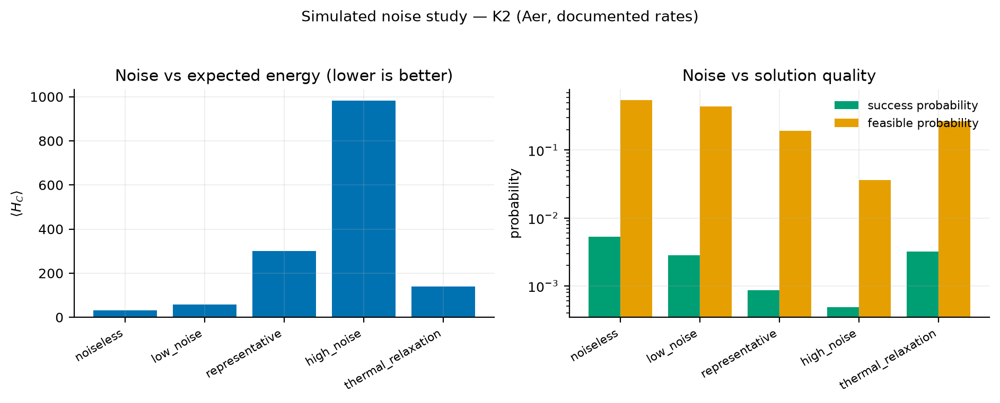

| model | ⟨H_C⟩ | success prob | feasible prob |
|---|---|---|---|
| noiseless | 31.3 | 0.00525 | 0.544 |
| low (1e-3 two-qubit) | 57.0 | 0.00281 | 0.442 |
| representative (1e-2) | 301.4 | 0.00085 | 0.192 |
| high (3e-2) | 982.7 | 0.00049 | 0.036 |
| thermal T1/T2 | 138.6 | 0.00317 | 0.265 |

At representative current-hardware error rates success probability falls **6×** and
feasible probability from 54% to 19%.

### 4.4 Error mitigation — what is *done* about the noise

Measuring degradation is only half the question. Two mechanisms are implemented:

| mechanism | where | what it corrects |
|---|---|---|
| **Readout-error mitigation** | classical; simulator **and** hardware | measurement error, via per-qubit confusion-matrix inversion |
| **Dynamical decoupling (XY4) + twirling** | hardware, via Qiskit Runtime options | idle dephasing; converts coherent gate error to stochastic |

A full $2^n \times 2^n$ confusion matrix is impossible at 16–20 qubits, so the standard
**tensored** model is used — readout errors assumed independent per qubit, so the inverse
applies one qubit at a time in $O(n 2^n)$. That assumption ignores correlated crosstalk and
is stated rather than hidden.

**Validation.** Calibration recovers an *injected* 4% readout error to within 1.2% (a test
asserts this), and on a noiseless backend it finds **p01 = p10 = 0.000000** — so it applies
no spurious correction to clean data.

**Measured effect** (12 qubits, 8192 shots):

| noise level | p=1 success | p=2 success | p=2 feasible |
|---|---|---|---|
| low (1e-3) | 1.06× | **1.09×** | +2.2 pp |
| representative (1e-2) | 1.02× | 1.05× | +1.4 pp |
| high (3e-2) | 0.98× | **0.95×** | +0.1 pp |

**The improvement is modest, and at high noise it is slightly negative.** Both are the
expected result, not a failure: readout mitigation corrects *measurement* error only, while
at these two-qubit gate counts the dominant loss is gate error accumulated during the
circuit, which no post-processing can undo. At high noise the distribution is already
noise-dominated and inversion mainly adds variance. Feasible probability — the more robust
signal — improves at every level.

Reproduce: `./.venv/bin/python -m backend.experiments.mitigation_study`

### 4.5 Real quantum hardware

Executed on **`ibm_fez`** (IBM Heron r2, 156 qubits), job `db16cahb694s73drs9vg`,
8 qubits used, 4096 shots. Parameters were optimised on the simulator; hardware sampled
the final circuit only — one job.

| source | success | × uniform | feasible | found E*? |
|---|---|---|---|---|
| uniform random | 0.00391 | 1.0 | — | — |
| ideal simulation | 0.00828 | 2.1 | 0.3502 | ✓ |
| noisy simulation (1e-2) | 0.00854 | 2.2 | 0.3091 | ✓ |
| **real hardware** | **0.00781** | **2.0** | **0.2847** | **✓** |

**The device reached 94% of ideal-simulation success probability and sampled the exact
optimum.** At 87 two-qubit gates the circuit is short enough that real structure survives
— which is precisely why the run was sized small rather than using the headline config.

**Transpilation cost, measured end to end:** 28 logical two-qubit gates → 56 on an abstract
all-to-all basis → **87 on `ibm_fez`'s real connectivity**. That 55% increase is routing
overhead, and it is the concrete reason this project reports logical *and* transpiled
metrics separately rather than quoting logical depth alone.

**Mitigation on the device.** Readout calibration measured the real error rates —
`p01 = 3.11%`, `p10 = 3.32%`, worst qubit **18.6%** — then inverted them:

| | raw | mitigated |
|---|---|---|
| success probability | 0.00781 | 0.00735 (0.94×) |
| feasible probability | 0.2847 | **0.3213** (+12.9%) |

Mitigation **improved feasible probability substantially but slightly reduced success
probability**. That split is consistent with the simulator study (§4.4), where the gain
also shrank and then reversed as noise grew: inverting a confusion matrix sharpens the
broad shape of the distribution while adding variance to individual low-probability
outcomes — and the optimum is exactly such an outcome. Dynamical decoupling (XY4) and
gate/measurement twirling were active for the run itself.

Reproduce: `./.venv/bin/python -m backend.experiments.hardware_run`

### 4.6 The ML mutation landscape

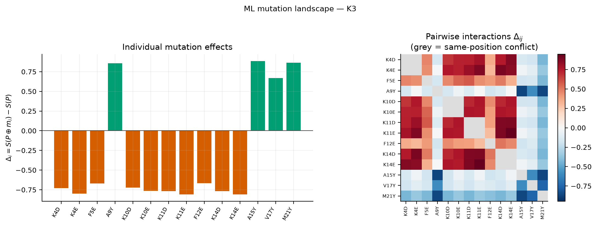

### 4.7 Model quality, stated plainly

| model | target | n | test RMSE | mean-baseline | Spearman |
|---|---|---|---|---|---|
| activity | `6 − log₁₀(MIC[µM])` | 2,328 | 0.760 | 0.904 | **0.559** |
| hemolysis | `6 − log₁₀(D₅₀[µM])` | 916 | 0.720 | 0.746 | **0.423** |

The hemolysis model beats the baseline by only 3.5%. An independent cross-check supports
the signal being real: a classifier trained on a **disjoint** labelling (experimenters'
stated determinations, no thresholding of any number) reaches balanced accuracy
**0.672 ± 0.064** against a 0.561 majority baseline, and agrees with the regression at
Spearman **+0.209**.

### 4.8 Can the models predict a mutation's effect?

The metrics above are *absolute* accuracy. The pipeline depends on something different.
DRAMP contains natural analogue series, so the held-out test split already contains real
point-mutant pairs — both members independently assayed, both withheld from training.

| | activity | hemolysis |
|---|---|---|
| held-out point-mutant pairs | 1,053 | 371 |
| **same-study** pairs (the fair comparison) | **736** | **265** |
| directional accuracy, same study | **59.4%** | **58.9%** |
| Spearman ρ, same study | **0.216** | **0.251** |
| directional accuracy, **pooled** | 49.8% | 59.1% |

**Stratifying by publication is essential, and it inverts the activity result.** Pooled, the
activity model looks like a coin flip. But a pair whose members come from *different* papers
carries inter-laboratory and inter-organism variation no sequence model could predict — that
stratum is strongly anti-correlated (ρ = −0.44) and drags the pooled figure down.

**Honest reading: ≈59% is weak.** Meaningfully above chance, and the right order of
magnitude for a tool that proposes candidates for experimental follow-up — not one that
replaces the experiment.

---

## 5. Quickstart

**Requirements:** Python 3.12+, Node 20+, ~2 GB disk. No GPU. No quantum hardware required.

```bash
python3 -m venv .venv && ./.venv/bin/pip install -r requirements.txt
```

```bash
./.venv/bin/python -m backend.data.download
```

```bash
./.venv/bin/python -m backend.data.curate
```

```bash
./.venv/bin/python -m backend.models.train
```

```bash
./.venv/bin/python -m backend.models.hemolysis_classifier
```

Verify — expect **189 passed**:

```bash
./.venv/bin/python -m pytest tests/ -q
```

Run the application:

```bash
./.venv/bin/python -m uvicorn backend.app:app --port 8000
```

```bash
cd frontend && npm install && npm run dev
```

Open <http://localhost:5173>.

### Experiments

The complete scientific experiment at K=2 and K=3:

```bash
./.venv/bin/python -m backend.experiments.final
```

Scaling benchmark across N = 6 … 18:

```bash
./.venv/bin/python -m backend.experiments.scaling
```

Mutation-extrapolation accuracy on real held-out point-mutant pairs:

```bash
./.venv/bin/python -m backend.models.mutation_extrapolation
```

Error-mitigation study:

```bash
./.venv/bin/python -m backend.experiments.mitigation_study
```

Publication figures:

```bash
./.venv/bin/python -m backend.experiments.figures
```

### Notebook

[`notebooks/Q_Peptide_Demo.ipynb`](notebooks/Q_Peptide_Demo.ipynb) walks the whole pipeline
with **pre-run outputs embedded** — no execution needed to read it. To regenerate:

```bash
./.venv/bin/python notebooks/build_notebook.py
```

---

## 6. Connecting IBM Quantum

**The project is fully functional without this.** Every QAOA result above comes from
simulation. Hardware execution is optional and is recorded as
`{"status": "not evaluated", "reason": ...}` when unavailable — never silently skipped.

### Step 1 — get a token

Create a free account at **[quantum.ibm.com](https://quantum.ibm.com)**, then copy your
API token from the dashboard (top-right profile → *API token*).

### Step 2 — put it in `.env`

```bash
cp .env.example .env
```

Edit `.env` and set:

```
QISKIT_IBM_TOKEN=paste_your_token_here
```

If your account uses an instance/CRN (IBM Quantum Platform), also set
`QISKIT_IBM_INSTANCE`. **`.env` is gitignored** — the token is read from the environment
only, never written into source or into any results file.

### Step 3 — verify it is detected

```bash
curl -s http://127.0.0.1:8000/api/health | grep ibm_credentials_present
```

The UI's **QPU** chip turns from `—` to `ready`, and the hardware checkbox on the
**Optimize** page becomes selectable.

### Step 4 — run on hardware

Either tick *Execute on IBM Quantum hardware* in the Optimize page, or:

```bash
./.venv/bin/python -m backend.experiments.final
```

which attempts hardware automatically when a token is present. The code selects the
least-busy operational backend with enough qubits, transpiles at optimization level 3, and
records **backend name, job ID, shots, transpiled depth, two-qubit gate count** and the
measured distribution.

**Mitigation is applied automatically on hardware** — dynamical decoupling (XY4) and
gate/measurement twirling via Runtime options, plus readout calibration measured on the
*same* backend and inverted classically. Raw and mitigated statistics are both recorded, so
the improvement is visible rather than assumed.

### What to expect

**This has been run.** See §4.5 — on `ibm_fez` the small config reached 94% of
ideal-simulation success probability and sampled the exact optimum. The figures below are
why it was sized that way:

| | |
|---|---|
| circuit size | 16–20 qubits, **364–570 transpiled two-qubit gates** at p=2–3 |
| realistic outcome | at that gate count the distribution will likely be close to uniform |
| simulated comparison | at 1e-2 two-qubit error, feasible probability already falls 54% → 19% |
| queue | free-tier jobs can wait minutes to hours |

A poor hardware result is a **legitimate finding** and is reported as measured. If you want
the cheapest meaningful hardware run, use **p=1** and a smaller **N** (fewer candidate
mutations) — that cuts the two-qubit count roughly proportionally.

> **Note on cost:** this project never uses hardware for the optimization loop, only to
> sample the *final* circuit at already-optimised parameters. That is one job, not hundreds.

---

## 7. The interface

**What this is, honestly.** It is a results browser, not a scientific instrument. All the
science happens in the Python layer and is reproducible from the command line without ever
opening it; the UI reads the same `results/experiments/*.json` files the scripts write. It
exists so the QUBO matrix, the Δᵢⱼ interactions, the verification outcomes and the hardware
comparison can be *inspected* rather than taken on trust — and so a reviewer can see that
every number traces to an executed run.

It does one thing beyond displaying: the **Optimize** page submits a real pipeline run
through the API, and the **Quantum** page rebuilds the actual bound circuit on request.
Everything else is a view.

Pages render **only what was executed**. If something has not been run, the page says
*"Not evaluated"* with the reason — no placeholder numbers appear anywhere.

Built with React, TypeScript, Tailwind and Recharts, with springs from Motion. Design is
Ethereal Glass: OLED-black surfaces, a fixed radial mesh, nested "double-bezel" card
architecture, Plus Jakarta Sans and JetBrains Mono. `prefers-reduced-motion`,
`prefers-reduced-transparency` and `prefers-contrast` are each honoured separately.

### Overview


### The claims, as a bento of executed measurements

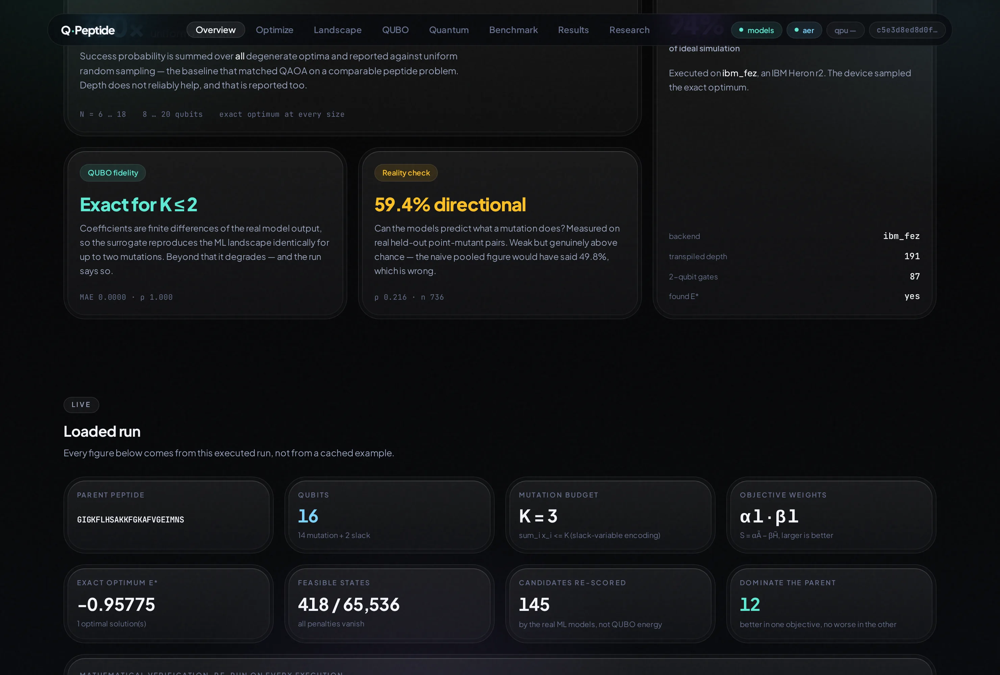

### Mutation landscape — Δᵢ, Δᵢⱼ, and mutual exclusivity

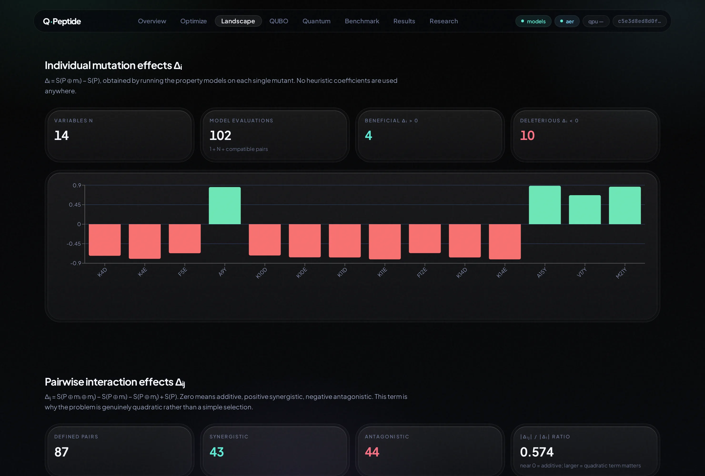

### QUBO — the real matrix, coefficients, penalties and verification badges

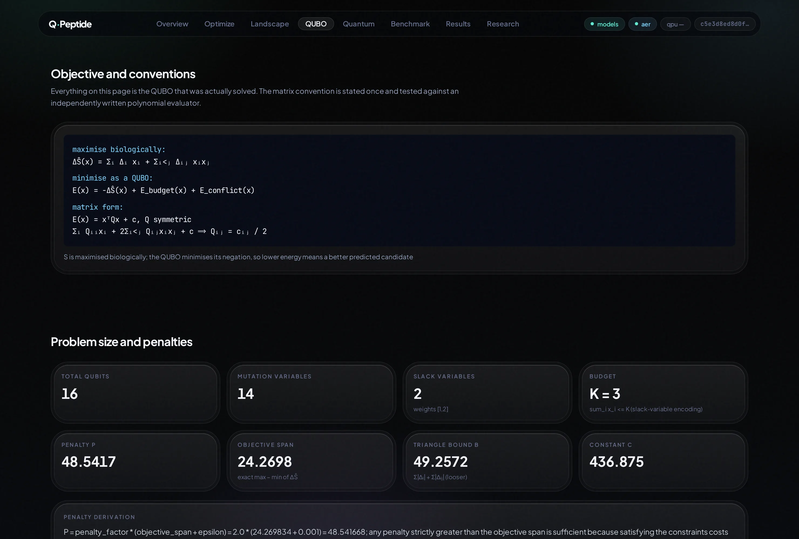

### Quantum analysis — circuit cost, convergence, distribution, noise, mitigation

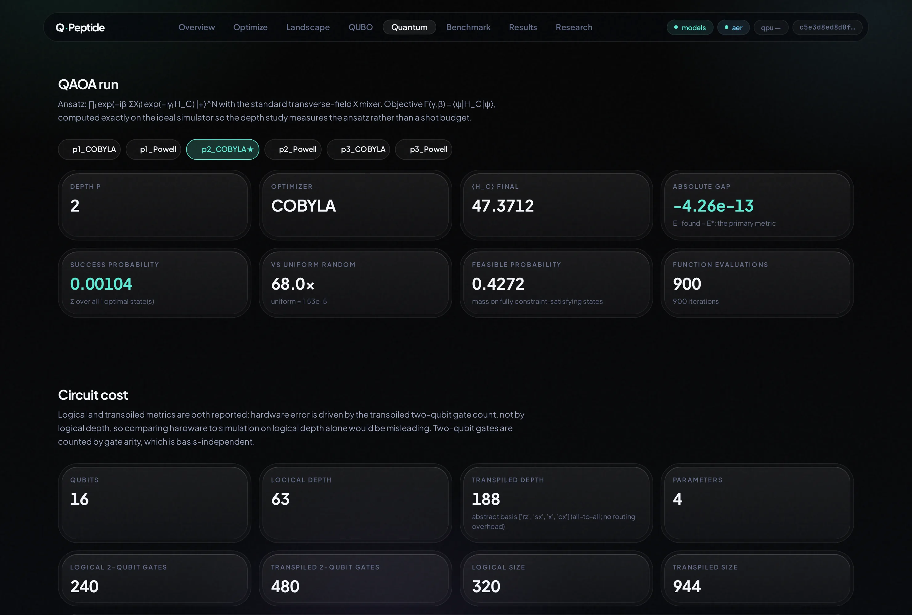

### Benchmark — every method on the identical QUBO, plus the scaling experiment


### Results — candidates ranked by direct ML score, with a Pareto front

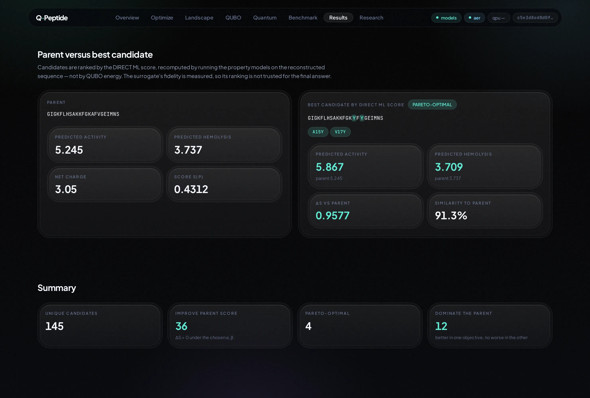

### Research — literature, audit, and the measured limitations


The literature review is served from `research/literature_review.md` and rendered in the
browser, with the derivations typeset through KaTeX rather than shown as LaTeX source:

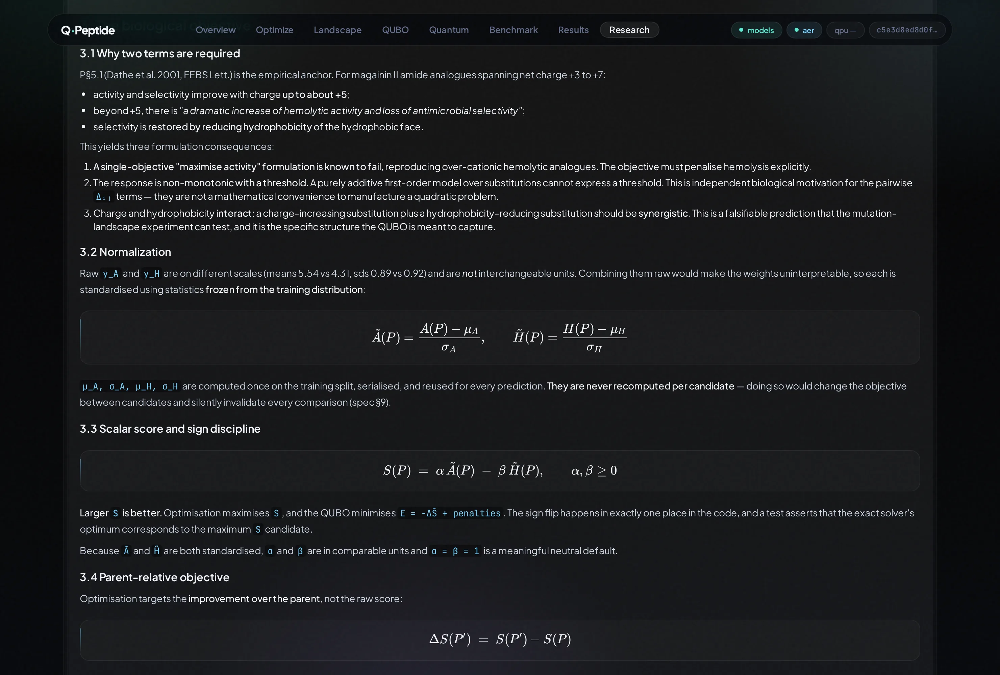

---

## 8. Repository

```
q-peptide/
├── README.md                      this file
├── notebooks/
│   ├── Q_Peptide_Demo.ipynb       executed, outputs embedded
│   └── build_notebook.py          regenerates it
├── docs/
│   ├── ARCHITECTURE.md            HLD + LLD
│   ├── IMPLEMENTATION_AUDIT.md    built vs. claimed, including corrections
│   ├── capture_screenshots.py     reproducible UI capture
│   └── images/                    screenshots
├── research/
│   ├── literature_review.md       formulation decisions and their sources
│   ├── papers.md                  annotated bibliography
│   └── scientific_audit.md        adversarial self-review
├── backend/
│   ├── app.py                     FastAPI · 12 endpoints
│   ├── data/                      download · parse · curate · split
│   ├── features/                  sequence → feature vector
│   ├── models/                    property models · training · classifier · extrapolation
│   ├── optimization/              mutations · landscape · QUBO · Ising · solvers ·
│   │                              QAOA · mitigation
│   ├── experiments/               final · scaling · figures
│   ├── schemas/                   Pydantic contracts
│   └── utils/peptide.py           validation and physicochemistry
├── frontend/                      React · TypeScript · Tailwind · Recharts · Motion
├── results/
│   ├── experiments/*.json         every executed run
│   └── figures/*.png              publication figures
├── tests/                         189 tests
├── requirements.txt               pinned
└── LICENSE                        MIT
```

### Data

**Source: DRAMP** (`general_amps`, CC BY 4.0). Raw files are gitignored and reproduced by
`backend.data.download`; nothing is redistributed here.

```mermaid
flowchart LR
    A["DRAMP general_amps<br/>12,784 rows"] --> B{"valid sequence?<br/>canonical 20 aa<br/>length 5–60"}
    B -->|"10,074 pass"| C["parse free text"]
    B -->|"2,710 dropped"| X1["counted in<br/>curation_report.json"]

    C --> D["MIC from prose<br/>µM · µg/mL · mg/L · nM"]
    C --> E["hemolytic dose<br/>HD50 · HC50 · LD50"]
    C --> F["explicit statements<br/>'no hemolysis detected'"]

    D --> G["unify units via MW<br/>computed from sequence"]
    E --> G
    G --> H["p-scale<br/>6 − log10(c)"]

    H --> I["activity.csv<br/><b>2,328 sequences</b>"]
    H --> J["hemolysis.csv<br/><b>916 sequences</b>"]
    F --> K["hemolysis_cls.csv<br/><b>385 sequences</b><br/>no thresholding"]

    I --> L["collapse exact duplicates"]
    J --> L
    K --> L
    L --> M["cluster at 70% identity"]
    M --> N["split at CLUSTER level<br/>no cluster spans train/test"]

    N --> O["activity model"]
    N --> P["hemolysis model"]
    N --> Q["classifier<br/>cross-check"]

    style A fill:#161b2b,stroke:#64718f,color:#f4f6fb
    style I fill:#12241f,stroke:#5eead4,color:#f4f6fb
    style J fill:#12241f,stroke:#5eead4,color:#f4f6fb
    style K fill:#12241f,stroke:#5eead4,color:#f4f6fb
    style N fill:#1a2033,stroke:#7dd3fc,color:#f4f6fb
    style X1 fill:#2a2415,stroke:#fbbf24,color:#f4f6fb
    style O fill:#1b1b33,stroke:#a78bfa,color:#f4f6fb
    style P fill:#1b1b33,stroke:#a78bfa,color:#f4f6fb
    style Q fill:#1b1b33,stroke:#a78bfa,color:#f4f6fb
```

DRAMP stores concentrations inside prose with heterogeneous units, so labels are parsed and
unit-unified using molecular weight computed from the sequence itself
($c[\mu M] = c[\mu g/mL] / MW \times 1000$). Every dropped row is counted in
`data/processed/curation_report.json`.

| stage | count |
|---|---|
| rows in release | 12,784 |
| valid sequences, length 5–60 | 10,074 |
| **activity** — rows with a parseable MIC | 2,429 (**2,328 unique**) |
| **hemolysis** — quantitative 50%-effect dose | 1,000 (**916 unique**) |
| hemolysis statements unparseable | 2,646 (dropped, counted) |

Two decisions came from *reading* the labels rather than assuming:

1. **DRAMP `general_amps` is all-positive** — no AMP negatives, so an AMP/non-AMP
   classifier is impossible from this source. **Activity is a regression.**
2. **Both quantities are continuous** with no principled threshold (D₅₀ spans
   0.005–8000 µM). **Hemolysis is also a regression**, with a statement-based classifier
   fitted separately as a threshold-free cross-check.

**Leakage control.** Exact duplicates collapsed first; sequences clustered by identity
(70%, the AMP convention) and split at the **cluster** level. A random split is also trained
purely to report the optimism gap — a validity statistic, not a performance number
(measured: +0.08 RMSE both targets).

### Testing

```bash
./.venv/bin/python -m pytest tests/ -q
```

**189 tests.** The principle is to test the mathematics against *independent
recomputation*, not against itself: Δᵢ and Δᵢⱼ against directly recomputed score
differences; QUBO matrix against an independently written polynomial evaluator; the Ising
mapping over **every** basis state; the fast simulator against Qiskit's `Statevector`; and
**a test asserting that a deliberately insufficient penalty FAILS** the sufficiency check.

---


---

## Citations

Prior work this project builds on, and is careful not to claim credit for:

- **Tučs, A. et al.** (2023). Quantum annealing designs nonhemolytic antimicrobial peptides
  in a discrete latent space. *ACS Medicinal Chemistry Letters* **14**(5), 577–582.
  [doi:10.1021/acsmedchemlett.2c00487](https://doi.org/10.1021/acsmedchemlett.2c00487)
  — the closest prior work; did this with quantum annealing and validated in the wet lab.
- **Boulebnane, S. et al.** (2022). Peptide conformational sampling using the Quantum
  Approximate Optimization Algorithm. *npj Quantum Information* **9**, 70.
  [arXiv:2204.01821](https://arxiv.org/abs/2204.01821) — found QAOA matched by random
  sampling on a peptide problem; the reason uniform random is a mandatory baseline here.
- **Lucas, A.** (2014). Ising formulations of many NP problems. *Frontiers in Physics*
  **2**, 5. [doi:10.3389/fphy.2014.00005](https://doi.org/10.3389/fphy.2014.00005)
- **Montañez-Barrera, J. A. & Michielsen, K.** (2024). Unbalanced penalization.
  *Quantum Science and Technology* **9**, 025022.
  [doi:10.1088/2058-9565/ad35e4](https://doi.org/10.1088/2058-9565/ad35e4)
- **Dathe, M. et al.** (2001). Optimization of the antimicrobial activity of magainin
  peptides by modification of charge. *FEBS Letters* **501**, 146–150.
  [doi:10.1016/S0014-5793(01)02648-5](https://doi.org/10.1016/S0014-5793(01)02648-5)
- **DRAMP 4.0** (2025). *Nucleic Acids Research* **53**(D1), D403. CC BY 4.0.

Full annotated bibliography: [`research/papers.md`](research/papers.md).

Built with [Qiskit](https://qiskit.org).

## Licence

MIT — see [LICENSE](LICENSE). DRAMP data remains under CC BY 4.0 and is not redistributed.
